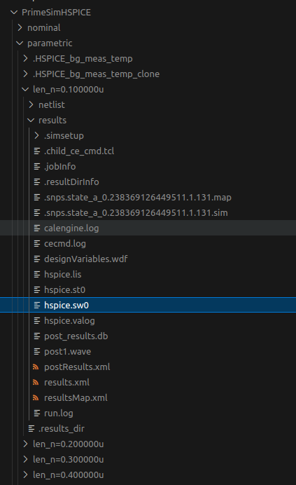

# VLSI

This repo contains the design curves and steps done during the course of "VLSI".

It uses the Matlab library [HSPICE TOOLBOX](https://www.cppsim.org/Manuals/hspice_toolbox.pdf) by Michael H. Perrott.

## Executing synopsis

Create a file `.secrets.sh` with the following contents:

```bash
#!/bin/bash

ip="<your IP>"
user="<your user>"
pass="<your password>"
```

Execute the scripts:

```bash
# Runs a script in the server
./synopsys.sh

# Run an interactive terminal on the server
./interactive.sh
```

The script `synopsys.sh` expects a file called `synopsys.sh` in the home directory with the following content:

```bash
#!/bin/bash

export LANG="en_US.UTF-8"
export LANGUAGE="en_US.UTF-8"
export LC_CTYPE="en_US.UTF-8"
export LC_NUMERIC="en_US.UTF-8"
export LC_TIME="en_US.UTF-8"
export LC_COLLATE="en_US.UTF-8"
export LC_MONETARY="en_US.UTF-8"
export LC_MESSAGES="en_US.UTF-8"
export LC_PAPER="en_US.UTF-8"
export LC_NAME="en_US.UTF-8"
export LC_ADDRESS="en_US.UTF-8"
export LC_TELEPHONE="en_US.UTF-8"
export LC_MEASUREMENT="en_US.UTF-8"
export LC_IDENTIFICATION="en_US.UTF-8"

cd ~/Proyecto_VLSI/analog
./run_cdesigner
```

## Getting the curves from HSPICE

1. To get the binary data from HSPICE, go to `Setup->Environment Options` and select `Output Data Format: fsdb`.

2. Run the simulations normally.

3. Run the script to copy the results from the Synopsys simulator to your local computer:

    ```bash
    # Change the variables "source_folder" and "destination_folder"
    ./copy_results.sh
    ```

4. After that, you should see the folder with the results like this:

    

5. The results file has the extension '.sw0'.
